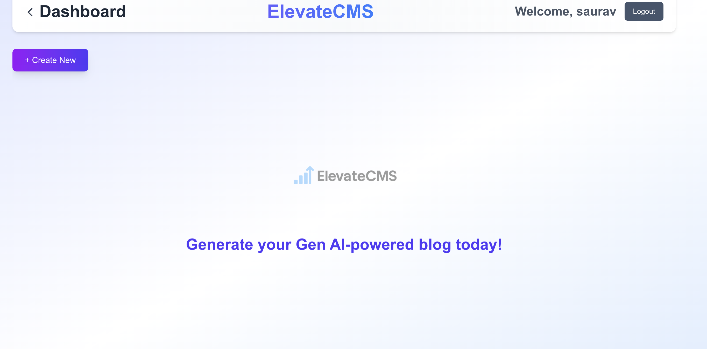
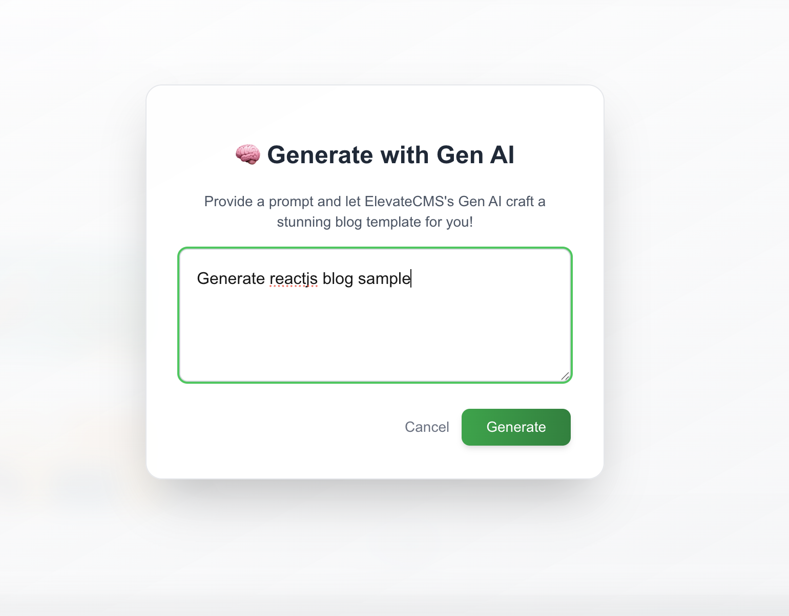
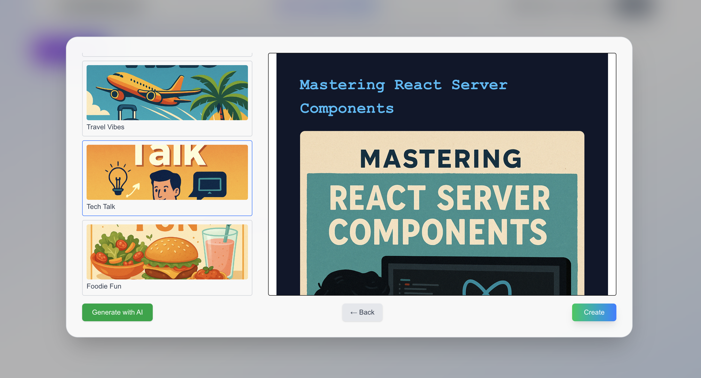
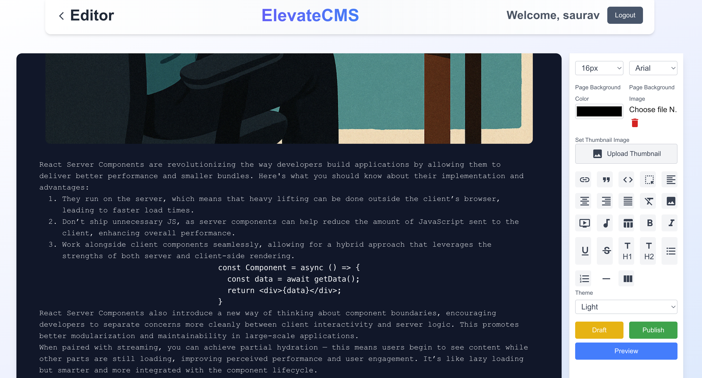
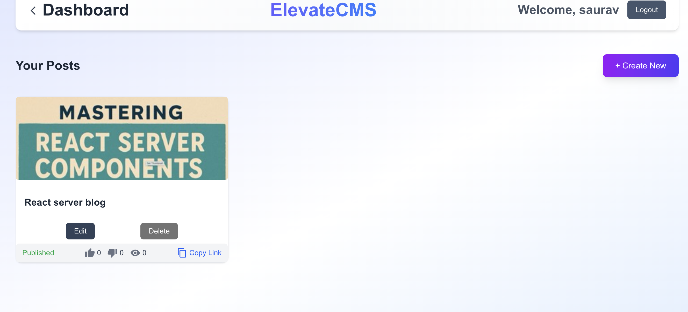

## 🚀 Live Demo  
🌐 [https://elevate-cms.vercel.app/]

---

## 📸 Product Tour — ElevateCMS in Action

ElevateCMS empowers you to craft beautiful, AI-generated blogs with ease. Here's a quick walkthrough of its features:

### 🔹 Dashboard  
Manage your blog posts from a sleek, minimal interface.

---

### 🤖 Generate with Gen AI  
Enter a simple prompt — and let ElevateCMS craft your blog structure and content.

---

### 🧩 Choose Your Template  
Select from rich, ready-to-go templates for different categories (Tech, Travel, Food, etc.).

---

### ✍️ Editor with Live Markdown Preview  
Customize font, theme, and layout with powerful markdown editing and preview.

---

### 📥 Post Management Panel  
Edit, delete, or publish your content. Instantly share blog links and track reactions.

---

## 🎯 What Makes ElevateCMS Different?

- ⚡ Powered by Gen AI to fast-track blog creation  
- 🧠 Markdown-first editing experience  
- 📱 Fully responsive, clean design  
- 🚀 Instant deploy on platforms like Vercel or Render  
- 🛡️ Built with Next.js App Router and server components

---

🧪 **Want to contribute or explore more?**  
Fork this repo, customize your own CMS, or integrate with your existing blog engine.

> Crafted with ❤️ by [@saurav](https://github.com/sauravsingh13)
